# stickers

Create and print your own custom stickers using a Roland DG vinyl printer/cutter
(available for use by TPL members at the
[North York Central Library Fabrication Studio](https://tpl.ca/using-the-library/computer-services/digital-innovation-services/fabrication-studio/)).

Tutorial video: https://www.loom.com/share/d3a934b9ef2d46a0a5c6d581f5440f7f

## Usage

> [!TIP]
>
> You'll need a Mac running macOS 13.0 or later, with
> [Inkscape](https://inkscape.org) and [mise](https://mise.jdx.dev) installed.

1.  Clone this repo to your computer:

    ```bash
    git clone https://github.com/hulloitskai/stickers.git
    cd stickers
    ```

2.  Install tool dependencies:

    ```bash
    mise install
    ```

3.  Find an photo you'd like to turn into a sticker. Then, cut out the subject
    (i.e. remove the background):
    - You can open the photo in Preview, right-click on it and select
      "Copy subject":
      
    - Alternatively, you can use the Pen tool in Figma to create a vector mask
      of the subject:

      

      Then, set the fill to black and remove the stroke.

      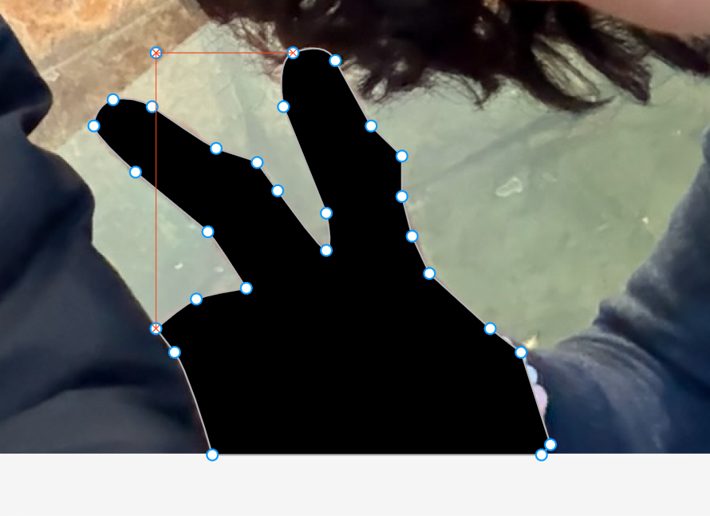

      Move the vector layer to be "underneath" the image layer, then right click
      the vector layer and select "Use as mask".

      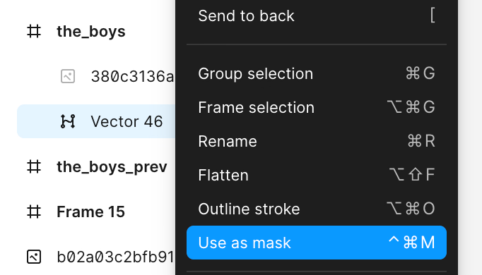

    The resulting image will be your "sticker image".

    > [!IMPORTANT]
    >
    > Please place the sticker image within the repository folder
    > (i.e. `stickers/my-project/<file>.png`)

4.  Convert the image to a black silhouette:

    ```bash
    mise silhouettify ./<file>.png  # creates ./<file>-silhouette.png
    ```

    > [!TIP]
    >
    > `mise silhouettify` and other tools will also work in subdirectories
    > within the the repo root.

5.  Use Inkscape to add a sticker border around your sticker image:
    1. Open the silhouette image in Inkscape. Then, select the image in "Layers
       and Objects".

       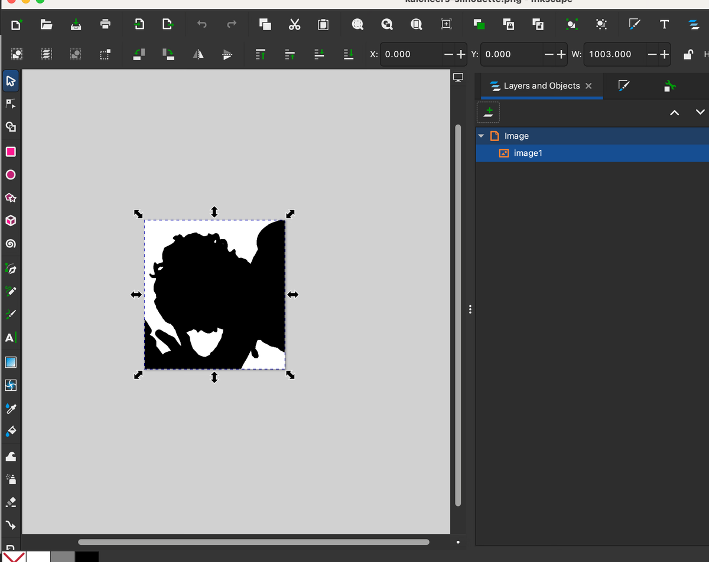

    2. Select "Trace Bitmap" and click "Apply". This creates a vector of the
       silhouette image.

       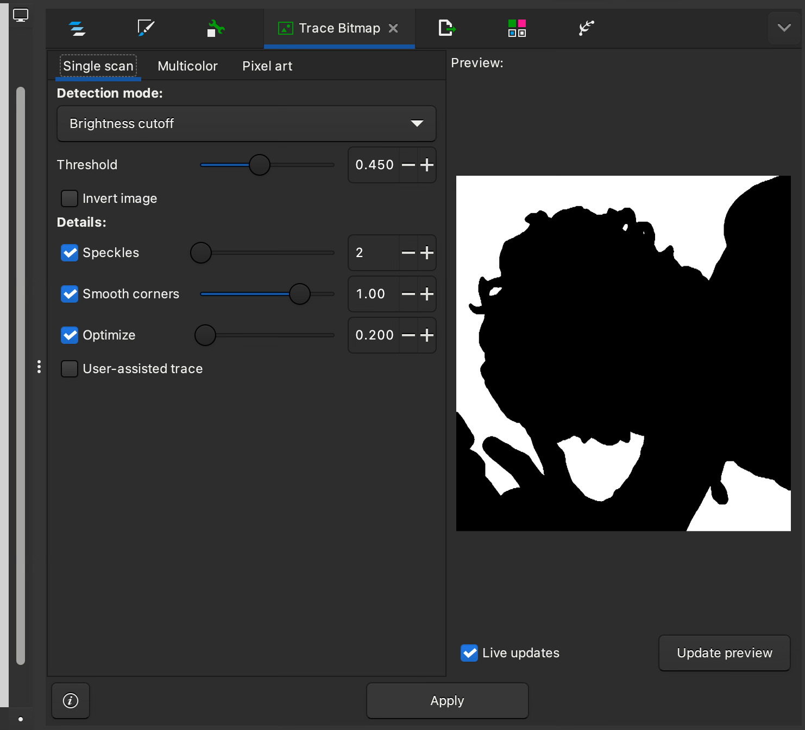

    3. Go back to "Layers and Objects" and delete the silhouette image.

       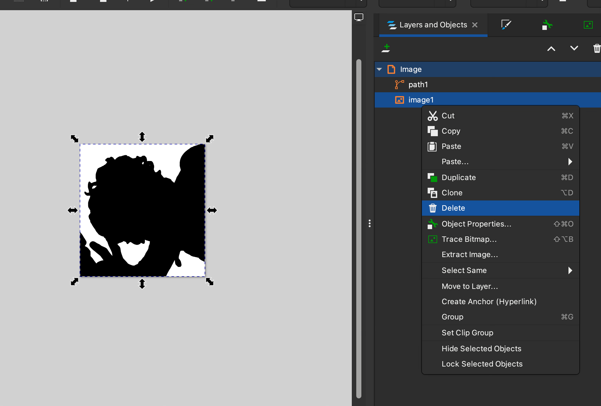

    4. Select the vector layer and press "N" on your keyboard to use the "Node Tool".

       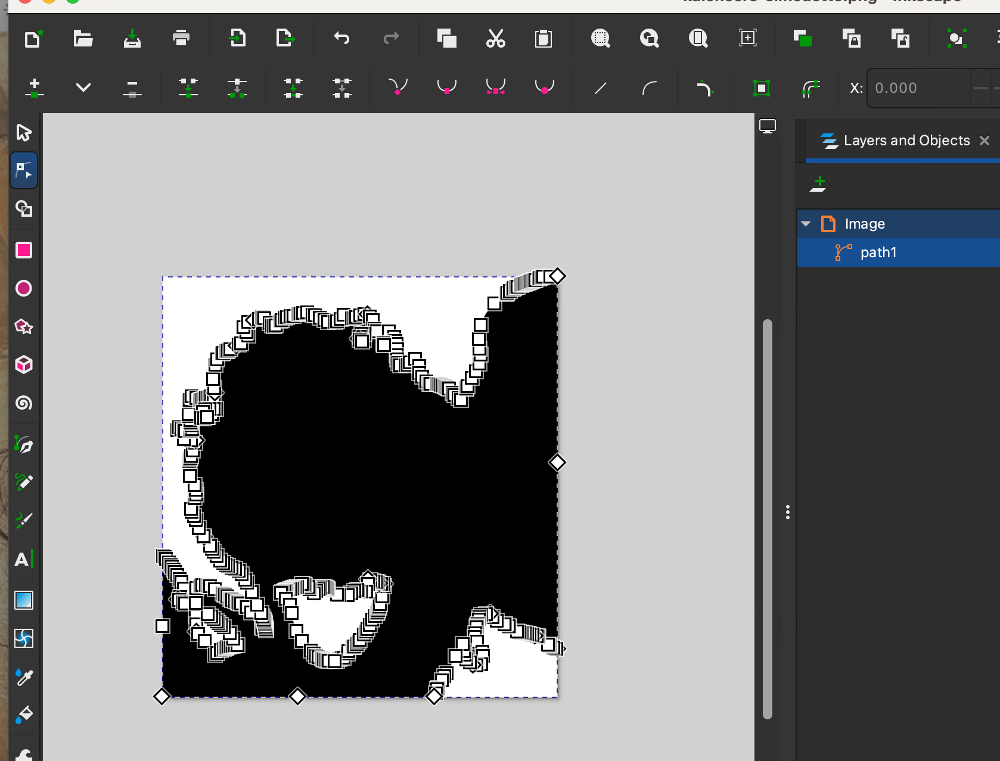

    5. Press "Cmd + L" to "Simplify" the vector path.

       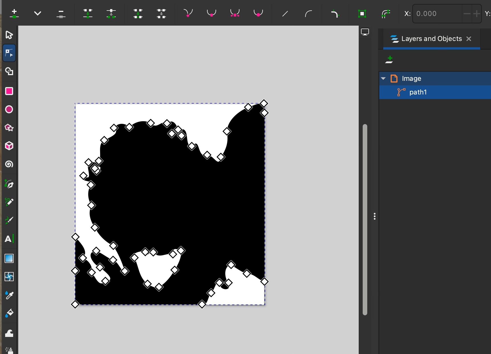

    6. Drag the sticker image to Inkscape. Press "S" to switch back to the
       "Selector Tool", which will allow you to move the sticker image. Overlay
       the Sticker image on top of the vector silhouette.

       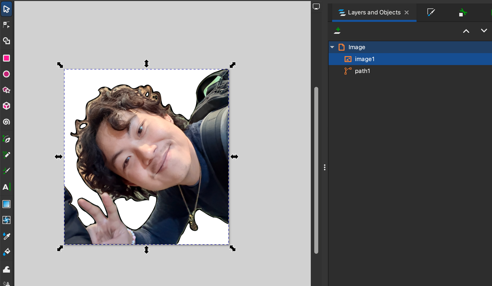

    7. Select the vector layer and press "Cmd + J" to enter Dynamic Offset mode.
       Then, drag the little handle that appears near the top of vector until you
       are happy with the offset. This will be the white border that appears
       around your sticker.

       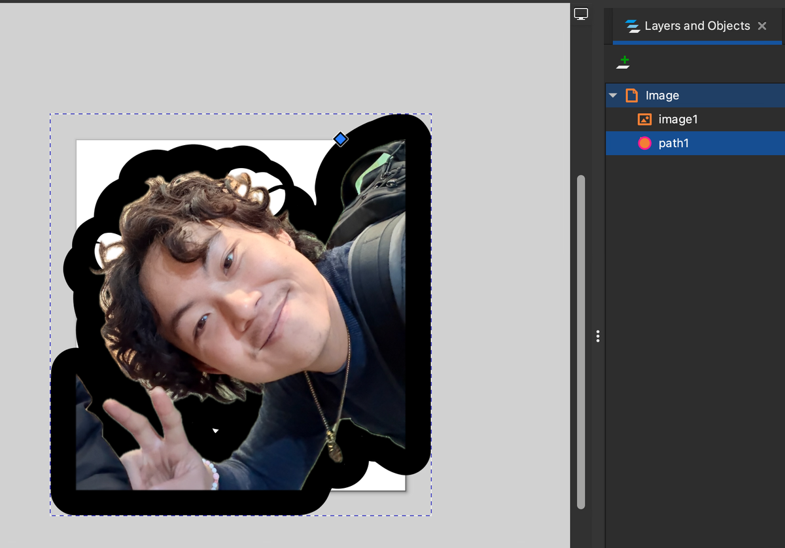

       > [!TIP]
       >
       > You may notice some weird artifacts / "glitches" that appear as you
       > drag the handle during Dynamic Offset mode. This is normal and will be
       > addressed in the next step.

    8. Press "Cmd + Shift + C" to finalize the offset and convert it into a vector
       path. Press N to switch to the "Node Tool", and you should now see all the
       new nodes that make up the extruded vector path.

       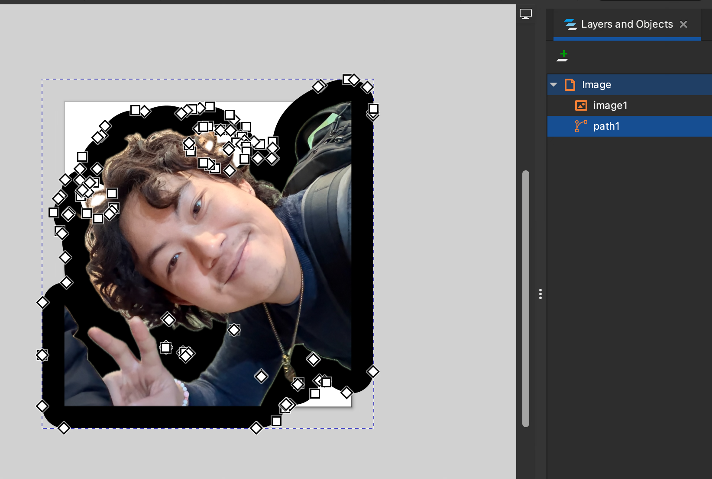

    9. Manually select and delete the nodes that create "holes" in the extruded
       silhouette vector. Also delete any nodes that create jagged spikes around
       the exterior path.

       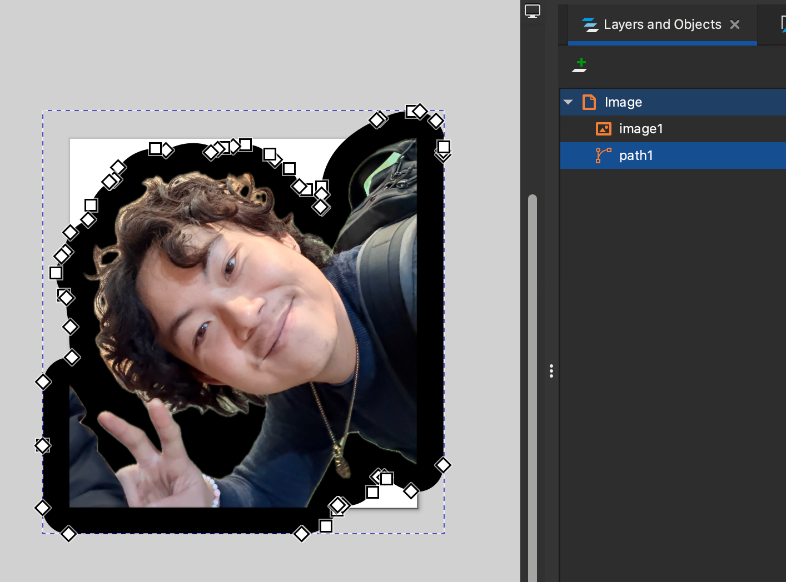

    10. Go to "Fill and Stroke" and set the fill to white and the stroke to
        black.

       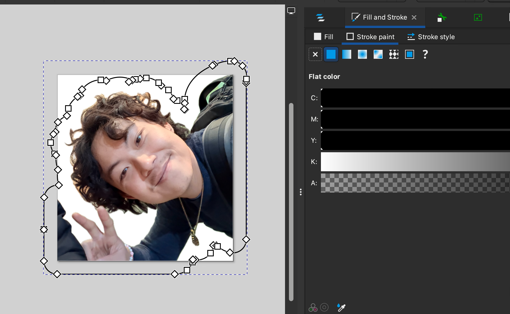
    11. While making sure the silhouette vector is selected, press
        "Cmd + Shift + R" to resize the document to the size of the vector.

        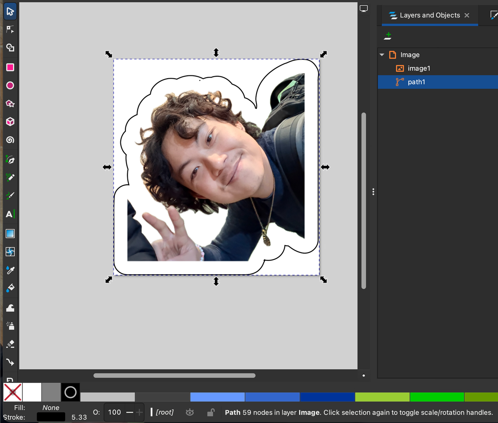

    12. Press "Cmd + Shift + S" to save the document as an SVG.

        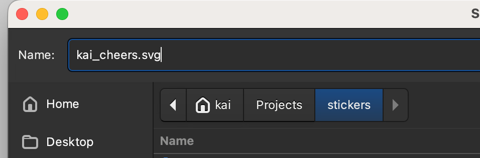

6.  Convert the black outline stroke into a CutContour line that a Roland vinyl
    cutter will recognize and automatically cut after printing:

    ```bash
    mise cutcontour ./<file>.svg  # creates ./<file>-cutcontour.pdf
    ```

    This file's physical printed size will vary according to the size of the
    sticker image, so:

7.  (Optional) Resize the final PDF to a specific size for printing. Simply
    specify _EITHER_ the width or height, and the other dimension will be
    automatically computed to preserve the aspect ratio:

    ```bash
    mise resize -H 5 ./<file>.pdf  # creates ./<file>-sized.pdf (5cm height)
    mise resize -W 4 ./<file>.pdf  # creates ./<file>-sized.pdf (4cm width)
    ```

    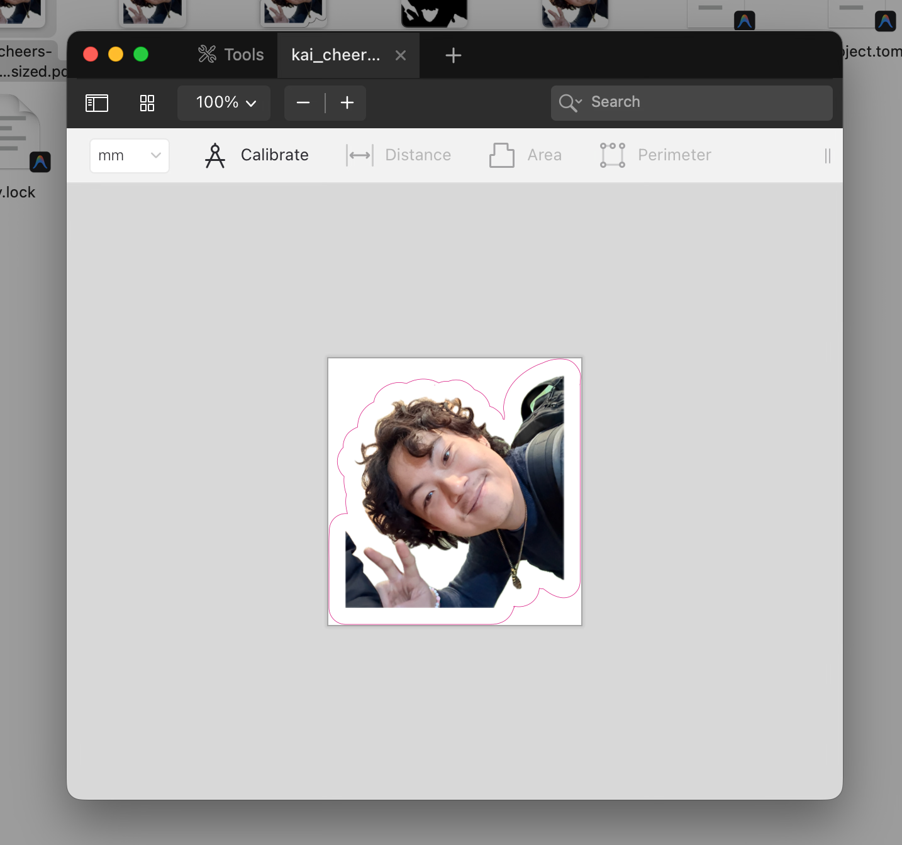

## Tools

### Setup

To install dependencies for all tools, run:

```bash
mise install
```

### Tool: `silhouettify`

Creates silhouette masks from PNG images using ImageMagick.

Basically, it takes a partially transparent image, keeps the transparent parts
transparent, while turning the non-transparent parts black. This makes it easier
for "image tracing" software to extract the outline of the image.

```bash
mise silhouettify ./<file>.png  # creates ./<file>-silhouette.png
```

### Tool: `cutcontour`

Takes an SVG and generates a PDF with the cut paths drawn using a
`CutContour` spot color separation, which Roland VersaWorks recognizes for
contour cutting. Also embeds any images from the SVG as the sticker artwork.

```bash
mise cutcontour ./<file>.svg    # creates ./<file>-cutcontour.pdf
```

### Tool: `resize`

Resizes PDF(s) to a target height or width in centimeters, preserving aspect
ratio.

This allows you to specify the sticker size beforehand if you don't want to
fiddle with the sizing at print-time in the VersaWorks software.

```bash
mise resize -H 10 ./<file>.pdf  # creates ./<file>-sized.pdf (10cm height)
mise resize -W 10 ./<file>.pdf  # creates ./<file>-sized.pdf (10cm width)
```
